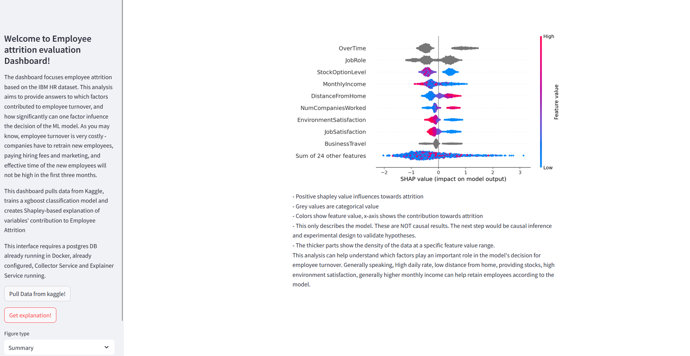

# Dmlab Próbafeladat


## Feladat részletei

- Adatok beszerzése egy publikus forrásból: Használj egy nyilvánosan elérhető API-t vagy egy könnyen scrape-elhető weboldalt. Gyűjtsd az adatokat egy SQL vagy noSQL adatbázisba, amely jobban illik a kiválasztott adatszerkezethez. Az adatok lehetnek például tőzsdei árak, piactér hirdetések, helyi éttermek ebédmenüi – olyan forrást válassz, ami üzleti szempontból releváns.
- Adatok feldolgozása: Végezz az adatokon valamilyen hasznos műveletet, ami üzleti értékkel bírhat. Nem szükséges gépi tanulási modellt építened; inkább arra vagyunk kíváncsiak, hogyan elemzed a nyers adatokat és milyen információkat tudsz kinyerni belőlük. Például vizsgálhatod az árváltozásokat, trendeket vagy egy adott termékkategória keresleti ingadozásait.
- A megoldás publikálása: A megoldásod tedd lokálisan használhatóvá frontend alkalmazás vagy REST API formájában, ahol az eredmények könnyen hozzáférhetők. A frontend lehet egy egyszerű dashboard vagy interaktív webes felület, míg az API biztosítson lehetőséget a feldolgozott adatok lekérdezésére és az eredmények visszaadására.


## Technikai követelmények

Programozási nyelv: A feladatot olyan programozási nyelven oldd meg, amelyben komfortosan dolgozol, bár a Python előnyt jelent számunkra.

Architektúra: A megoldás alapja legyen microservice architektúra, amely modularizálja az adatgyűjtési, feldolgozási és publikálási lépéseket.

Kipróbálhatóság: Fontos feltétel, hogy az elkészült kódod lokálisan kipróbálható legyen. Kérjük, biztosítsd, hogy minden szükséges leírás és konfiguráció elérhető legyen a GitHub-on.

Dokumentálás. Kérünk, hogy a munkád alapszinten dokumentáld. Néhány szóban írd le, hogy miért az adott probléma megoldását választottad, miért az adott technológiákkal dolgoztál, a megoldásod főbb részeinek működését.

# Megoldás

## Setup
Fontos megjegyzés: a kódban mindenhol angolul kommentelek, kivéve a readme-ben. Ez csak megszokás.

A githubon a main branchen található a működő kód. Ezt kérlek egy git clone-nal húzd le.

A projekt lokálisan futtatható, felállítottam egy poetry környezetet, hogy könnyen telepíthető legyen az összes csomag. Ez azért is fontos, hogy Ti is ugyanolyan verziójú csomagokat használjatok.

```commandline
poetry install
```


## API lehívás

A feladat során IBM HR adatait használom. Ezt a [kaggle](https://www.kaggle.com/datasets/pavansubhasht/ibm-hr-analytics-attrition-dataset/data)-ről töltöm le a saját API-jukkal. Azért ezt választottam, mert a munkavállalók megtartása kiemelten fontos a cégek számára, mert új alkalmazottakat be kell tanítani, sokszor olyan infrastruktúrában kell dolgozniuk, amit nem ismernek, így sokkal nagyob kockázatot jelentenek. Emiatt úgy gondoltam, hogy érdemes megvizsgálni azt, hogy melyek azok a válzotók, amelyekk leginkább hozzájárulnak a 

 Ennek feltétele, hogy saját kaggle fiókunk legyen. Biztonság miatt arra kérnélek, hogy csinálj Te is egy kaggle felhasználót majd a jöbb felső sarokban a profil képre kattintva étmegyünk a Settings részre, ahol az API-nál csinálhatunk access tokent. Amennyiben ezt nem szívesen csinálod meg, e-mailben mellékelem az én access tokenemet.

A letöltött .json file-t kérlek ide másold: C:\Users\<Your Username>\.kaggle\
Feltéve hogy windowsod van.

Valahogy így néz ki:


Van egy nagyon jó magyarázat hogyan lehet kaggle-ről adatsorokat letölteni, ezt [itt](https://medium.com/@vinaychavda.de/a-guide-to-extracting-data-from-kaggle-for-your-data-science-projects-e15ef8ffc054) találod.


IBM HR data 

A *data_request.py* fileban egy teszt található, aminél letölti a rendszer egy temp mappába egy beadott kaggle adatbázist (akár több .csv-vel rendelkező), majd beolvassa a kicsomagolt csv-ket a memóriába. Ezután ezt elmenti az adatbázisba, majd teszteli, hogy lekérhető-e az adat.

## Adattárolás

A feladat kifejezetten kéri a microservice architektúrát, ezért postgresql-t használok Dockerrel.

Ennek futtatásához szükség van a [Docker](https://hub.docker.com/)-re. Az első lépés, hogy lehúzzuk a postgresql DB-jét a Docker Hubról!
Írjuk a terminálba, hogy:
```commandline
docker pull postgres
```

Létrehozunk egy Docker volume-ot, hogy meg tudjuk tartani az adatsort leállítás után is (ez akkor lenne fontos, ha konstans adatok érkeznek).

```commandline
docker volume create postgres_data
```

Futtassuk a postgres containert:

```commandline
docker run --name hr_data -e POSTGRES_PASSWORD=mysecretpassword -d -p 5432:5432 -v postgres_data:/var/lib/postgresql/data postgres
```
Ebben a példában az alap adatbázist használjuk bármiféle "security" nélkül. 

Ha minden jól ment, akkor a DockerHubon a következőt látod:


Én pgadmint használok a fejlesztés során, megtalálhatod [itt](https://www.pgadmin.org/). Ezzel monitorozhatod a postgresql adatbázist.
https://www.dbvis.com/thetable/how-to-set-up-postgres-using-docker/

Két fontos mozzanata van: feltöltés (data_request.py-ben) az upload_to_db és pull_table.

A rendszer képes kezelni, ha esetleg több csv fájlt csomagolna le a kaggle. Jelen esetben ez 1.

## Modelling

A feladat egyszerű - szeretném megvizsgálni azt, hogy egyes munkavállalóknál mi az ami hozzátehet a kiégéshez/lemorzsolódáshoz (ami egy bináris label). Ezért a draft_data_processing.ipynb-ban csináltam egy gyors xgboost klasszifikációs modelt, majd ennek a SHAP elemzését. Így individuálisan magyarázhotó, kinél mi volt a MODEL!!! szerint lehetséges kiégést okozó faktor. Természetesen ez nem kauzalítás, és a modell vehet alapul olyan feltételezéseket, amelyek hamisak. Ezért mindig fontos tesztelni a kauzalítást, és kísérlettervezéssel célratörően megvizsgálni, hogy vajon tényleg ilyen mértékben befolyásolhatták-e a munkavállalókat a faktorok.

_______

A kategórikus változókat jóllehet nem dolgoztam fel teljesen, ezt tovább lehetne bonyolítani sklearn.preprocessing.LabelEncoder-rel. Az idő miatt ezt nem tettem meg, ez az analízisben a summary-ben szürke színként jelen majd meg.

Készítek egy korrelációs táblát, számos numerikus változó korrelál egymással. Confounding faktorok lehetnek az analízis során, de ez most nem lényeges.

GridSearch-csel készítek egy xgboost modelt. Azért válaszottam ezt a modelt mert:
- Gyors (párhuzamosítva és optimálva van, jól kezeli a tabuláris, nagy adattáblákat)
- Gyakran jobb eredményt ad mint egy szimpla random forest, vagy alap módszer
- Interpretabilítás nem lényeg (SHAP miatt)

Accuracy alapján tanítom a modellt, mert itt minden érték eltalálása számít.

Az analízis a SHAP módszeren alapul ami alapvetően a model interpretability problémájának megoldására lett kifejlesztve.  A SHAP kiszámolja az egyéni hozzáadott értékeket, és az értékek szummája a várható értéktől való eltérés. Ez egy kipróbált módszer és nagyon jó arra hogy megvizsgáljuk a modellünk miért döntött úgy ahogy. A shapley értékek tulajdonképpen alkalmazhatóak arra hogy munkavállaloknál egyes faktorok mennyire játszanak bele valakinek a lemorzsolódásába, de természetesen kiemelendő, hogy a modell szerint. Az ábrák könnyen értelmezhetőek szakértők számára, egy kis leírással pedig akár bárki értelmezheti őket.

modelling.py -ben függvényekké alakítottam a fontosabb lépéseket, hogy ne kelljen a frontend fejlesztéssnél újraírni.


## Frontend

Streamlit-et választottam mert egyszerű dashboardot készíteni vele. Technikailag jobb lenne ha építenék egy FastAPI backendet modelltanításra, mlflow-t MLOPS-ra és VC-ra, de az nem fér bele az allokált időbe. Korrelációs mátrixot a draftban vizsgálok, de a dashboardba nem került bele.

Létrehoztam egy modelling.py-t, ami tartalmazza a releváns funkciókat a draftból. Ezt és a data_request.py-t használom a streamlitben.

```commandline
streamlit run frontend.py
```


Végeredmény:



Ahol négy interaktálható elem van:
- Pull Data from kaggle __gomb__ : Letölti az adatsort a kaggle-ről, feltölti a DB-be, lehúzza az adatot a DB-ről (showcase jelleggel), és elkészíti a Shapley értéket
- Explain data! __gomb__ : A felső gomb funkcionalítása, de nem tölti le az adatsort. Ez akkor jó ha újraindítom az alkalmazást, de az adat még benn van a DB-ben.

- Figure type __selectbox__ : Ez két fajta ábrázolást mutat - Summary, ami az egész adatbázist magyarázza, és az Individual-t ami pedig a munkavállalokat (mintákat) magyarázza.

- Employee number __selectbox__ : Csak a minták vizsgálatánák releváns. ID alapján kiválasztunk egy munkavállalót, és őt magyarázzuk.

Az ábrákat cache-elem, tehát nem kell egynél többször regenerálni, szintúgy a Shapley értékeket. A gombok funckionalítása is cachelve van, mert jelenleg nem változik a kaggle-n az adatsor. Természetesen ezt egy valós idejű rendszernél máshogy oldanám meg. Nem cache-lném ha külön microserviceben futtatnám és feltölteném a DB-be, majd onnan lekérném. Természetesen a modelt is el lehet menteni MLflow segítségével.

Elnézést kérek, hogy lassú a frontend, gyorsan oldottam meg a feladatot, és a microservice architektúra neméppen a legoptimálisabb egy ilyen "kicsi" feladat megoldásához.
